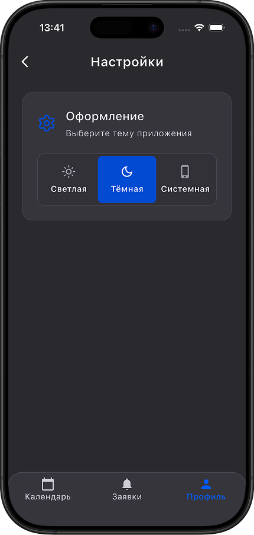

# Guide Manager

**Guide Manager** — Flutter-приложение для гидов, работающих с экскурсиями.
Приложение позволяет гиду зарегистрироваться, дождаться подтверждения администратора, просматривать назначенные экскурсии в календаре, подавать заявки на доступные экскурсии и отслеживать статус отправленных заявок.

Проект сделан как часть full-product связки:

Flutter client → [Guide Manager](https://github.com/wyroxx/guide-manager)
Admin panel → [Guide Manager Admin](https://github.com/wyroxx/guide-manager-admin)
Backend → Firebase Authentication + Cloud Firestore

Админская панель управляет компаниями, гидами, экскурсиями и заявками. Flutter-клиент использует те же Firestore-данные и security rules.

## Preview

<p align="center">
  
  &nbsp;&nbsp;
  
  &nbsp;&nbsp;
  
</p>

<p align="center">
  
  &nbsp;&nbsp;
  
  &nbsp;&nbsp;
  
</p>

## Demo

<p align="center">
  
</p>

## Основной сценарий

```txt
1. Пользователь регистрируется как гид.
2. В Firestore создаётся профиль guides/{uid} со статусом isApproved: false.
3. Администратор проверяет профиль и назначает уровень гида.
4. После подтверждения гид получает доступ к экскурсиям и заявкам.
5. Гид видит доступные экскурсии по своему уровню.
6. Гид отправляет заявку на экскурсию.
7. Администратор принимает или отклоняет заявку.
8. Гид видит обновлённый статус заявки.
9. Принятая экскурсия появляется в календаре назначенных экскурсий.
```

## Функционал

### Авторизация

* Регистрация и вход через email/password.
* Вход через Google.
* Восстановление пароля через email.
* Создание профиля гида при регистрации.
* Ограничение доступа для неподтверждённых гидов.

### Профиль

* Данные гида: имя, email, телефон, telegram, уровень, статистика.
* Empty state для профиля, если данные ещё не заполнены администратором.
* Экран настроек со сменой темы: светлая, тёмная, системная.

### Экскурсии

* Календарь назначенных экскурсий на 21 день.
* Список экскурсий на выбранную дату.
* Отображение маршрута, места встречи, времени, типа экскурсии и дополнительной информации.
* Empty/error states для пустых дней и ошибок загрузки.

### Заявки

* Список доступных экскурсий, на которые гид может податься.
* Фильтрация по уровню гида.
* Фильтрация экскурсий без свободных мест.
* Фильтрация компаний, где гид находится в blacklist.
* Список отправленных заявок.
* Статусы заявок: `pending`, `accepted`, `rejected`.
* Сортировка заявок по статусу и дате создания.
* Создание заявки только со статусом `pending`.

### UI/UX

* Поддержка light и dark theme.
* Reusable empty/error states.
* Toast-уведомления.
* SVG-иллюстрации для empty/error/blocked states.
* Единая дизайн-система: цвета, отступы, радиусы, typography.

## Стек

* Flutter / Dart
* Firebase Authentication
* Cloud Firestore
* Firebase Hosting
* Riverpod
* GoRouter
* Freezed
* json_serializable
* flutter_svg
* Shared Preferences
* GitHub Actions CI

## Архитектура

Проект использует feature-first структуру с разделением на `data`, `domain` и `presentation`.

```txt
lib/
  app/
    app.dart
    router.dart
    theme.dart
  core/
    ui/
    utils/
    enums.dart
  features/
    auth/
      data/
      domain/
      presentation/
    profile/
      data/
      domain/
      presentation/
    excursions/
      data/
      domain/
      presentation/
    applications/
      data/
      domain/
      presentation/
```

Основные правила архитектуры:

* UI не обращается к Firebase напрямую.
* Firebase-запросы находятся в repository/data layer.
* Domain layer не зависит от Flutter и Firebase.
* DTO используются для Firestore mapping.
* Domain entities используются в бизнес-логике.
* Состояния loading/error/data обрабатываются через Riverpod `AsyncValue`.
* Статусы и уровни гида описаны через enum, а не raw strings в UI.

## Firestore

Приложение использует Cloud Firestore как основное хранилище данных.

Основные коллекции:

- `guides/{uid}` — профиль гида и статус подтверждения.
- `companies/{companyId}` — компании и blacklist.
- `excursions/{excursionId}` — экскурсии.
- `excursions/{excursionId}/applications/{uid}` — заявки гидов на экскурсии.

Документы `guides/{uid}` и `applications/{uid}` используют Firebase Auth UID как ID.
Правила и индексы находятся в `firestore.rules` и `firestore.indexes.json`

## Tests & CI

GitHub Actions workflow находится в:

`.github/workflows/flutter.yml`

CI запускается на push в `main` и на pull request.

Pipeline:

```
flutter pub get
dart format --set-exit-if-changed lib test
flutter analyze
flutter test
```

## Запуск проекта

Установить зависимости:

```
flutter pub get
```

Сгенерировать Freezed/json_serializable файлы:

```
dart run build_runner build --delete-conflicting-outputs
```

Запустить приложение:
```
flutter run
```

## Связанный проект

Админская панель находится в отдельном репозитории:

[Guide Manager Admin](https://github.com/wyroxx/guide-manager-admin)

Админка отвечает за:

- создание и редактирование компаний
- создание и редактирование экскурсий
- управление профилями гидов
- подтверждение новых гидов
- принятие и отклонение заявок
- управление blacklist компаний

Flutter-клиент и админская панель используют одну Firestore-схему и общие security rules.
