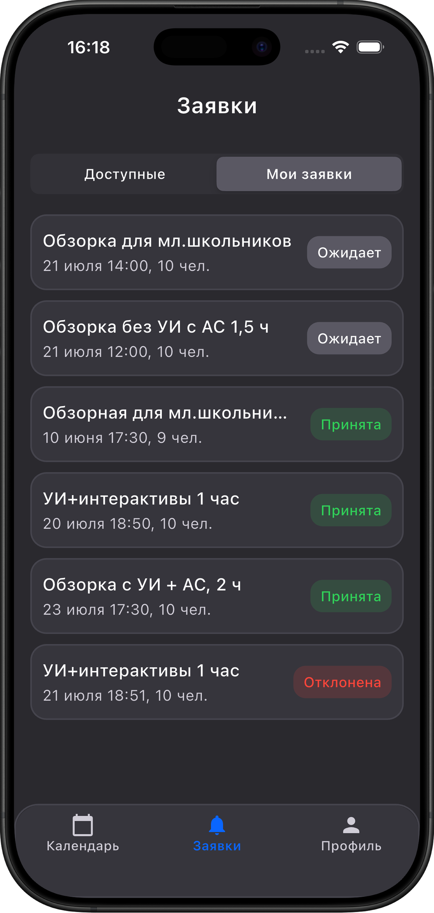

# Guide Manager

Flutter-приложение для гидов, которые работают с экскурсиями. Приложение позволяет авторизоваться, смотреть назначенные экскурсии в календаре, подаваться на доступные экскурсии и отслеживать статус своих заявок.

## Preview

<p align="center">
  
  &nbsp;&nbsp;
  
  &nbsp;&nbsp;
  
</p>

<p align="center">
  
  &nbsp;&nbsp;
  
  &nbsp;&nbsp;
  
</p>

## Функционал

- Авторизация через email/password и Google.
- Регистрация нового пользователя.
- Восстановление пароля через email.
- Профиль гида с контактными данными, уровнем и статистикой.
- Экран назначенных экскурсий с календарем на 21 день.
- Экран заявок:
  - доступные экскурсии по уровню гида
  - фильтрация экскурсий без свободных мест
  - фильтрация компаний, где гид находится в черном списке
  - список отправленных заявок со статусами
- Reusable empty/error states и toast-уведомления.

## Стек

- Flutter / Dart
- Firebase Authentication
- Cloud Firestore
- Riverpod
- GoRouter
- Freezed + json_serializable
- flutter_svg
- GitHub Actions CI

## Архитектура

Проект использует feature-first структуру:

```txt
lib/
  app/
    app.dart
    router.dart
    theme.dart
  core/
    ui/
    utils/
    enums.dart
  features/
    auth/
      data/
      domain/
      presentation/
    profile/
      data/
      domain/
      presentation/
    excursions/
      data/
      domain/
      presentation/
    applications/
      data/
      domain/
      presentation/
```

## Firestore

Приложение ожидает коллекции `companies`, `guides`, `excursions`.

```txt
companies/{companyId}
  address: string
  email: string
  createdAt: timestamp
  name: string
  phone: string
  banList: string[]

guides/{guideUid}
  name: string
  email: string
  phone: string
  level: "trainee" | "junior" | "middle" | "senior"
  toursCount: number
  createdAt: timestamp
  bio: string
  avatar: string
  telegramAlias: string

excursions/{excursionId}
  title: string
  excursionType: string
  maxParticipants: number
  paymentStatus: "paid" | "unpaid"
  startDate: timestamp
  endDate: timestamp
  route: string
  meetingPlace: string
  hasSpots: boolean
  requiredGuides: number
  requiredLevels: string[]
  hasLunch: boolean
  hasMasterclass: boolean
  companyId: string
  assignedGuides: string[]

excursions/{excursionId}/applications/{guideEmail}
  createdAt: timestamp
  email: string
  excursionId: string
  status: "pending" | "accepted" | "rejected"
```

## Firebase setup

Проект использует `lib/firebase_options.dart`, сгенерированный FlutterFire CLI.

Если нужно подключить новый Firebase-проект:

```sh
dart pub global activate flutterfire_cli
flutterfire configure
```

После этого проверьте, что `lib/firebase_options.dart` обновлен и что platform-specific Firebase-файлы добавлены согласно требованиям FlutterFire.

## Запуск

Установить зависимости:

```sh
flutter pub get
```

Запустить приложение:

```sh
flutter run
```

Сгенерировать Freezed/json_serializable файлы:

```sh
dart run build_runner build
```

При конфликте generated-файлов:

```sh
dart run build_runner build --delete-conflicting-outputs
```

## Проверки

Форматирование:

```sh
dart format lib test
```

Анализатор:

```sh
flutter analyze
```

Тесты:

```sh
flutter test
```

Сейчас тестами покрыты:

- валидаторы;
- форматирование дат;
- enum-маппинг уровней и статусов;
- общие empty/error widgets;
- auth text field;
- primary button.

## CI

GitHub Actions workflow находится в:

```txt
.github/workflows/flutter.yml
```

CI запускается на `push` в `main`/`master` и на `pull_request`.

Pipeline:

```txt
flutter pub get
dart format --set-exit-if-changed lib test
flutter analyze
flutter test
```

## Индексы Firestore

Правила и индексы хранятся в `firestore.rules` и
`firestore.indexes.json`. Документ одобренного гида должен использовать
Firebase Auth UID в качестве ID: `guides/{uid}`.

Для текущих запросов настроены индексы:

- `excursions`: `hasSpots` + `requiredLevels`
- `excursions`: `assignedGuides` + `startDate`
- `collectionGroup applications`: `email` с collection-group scope

Деплой конфигурации:

```sh
firebase deploy --only firestore:rules,firestore:indexes
```

Административная запись требует custom claim `admin: true`. Клиент может
читать только собственный профиль и заявки, а создавать заявку может только
со статусом `pending` при подходящем уровне, наличии мест и отсутствии email в
`banList` компании.

## Полезные команды

```sh
flutter clean
flutter pub get
dart run build_runner build
flutter analyze
flutter test
```
